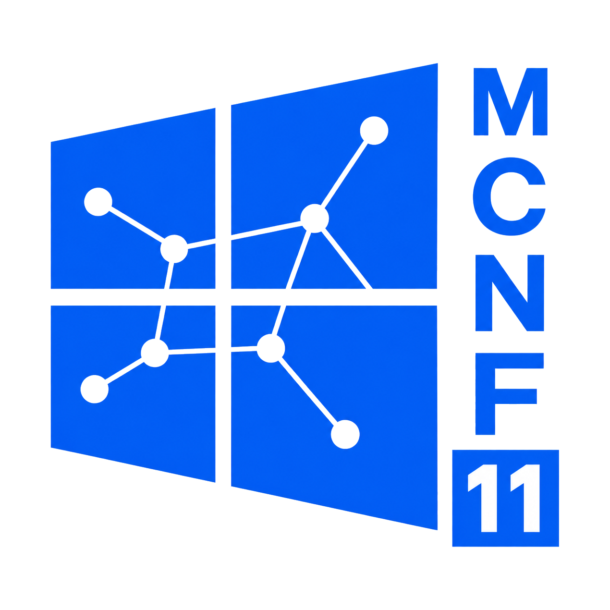

<p align="center">
  
</p>

# MCNF / magic-mesh

**A secure, no-fixed-center workgroup mesh — and an egui-native, DRM-native
thin-client VDI desktop OS — on stock Fedora.**

MCNF turns a small workgroup of machines into one private, encrypted mesh with
**no central server**: any node can author fleet policy, every node enforces it
itself, and the whole thing runs over a [Nebula](https://github.com/slackhq/nebula)
overlay with [etcd](https://etcd.io/) for coordination and
[Syncthing](https://syncthing.net/) replicating the shared disk.

On top of that mesh sits the **desktop**. Since the **E12 "Quazar" pivot**, MCNF
is **not** a general desktop with a compositor and native apps. It is a single
**egui shell that owns the DRM/KMS seat directly** — a winit-less smithay
DRM/GBM + libinput runner, **no Wayland compositor**. The desktop you actually
*use* is a **VM**: a full OS guest (Windows/Ubuntu/…) brokered over the mesh and
rendered egui-native (ironrdp/VNC/Spice → an egui texture). A browser, office
suite, or game runs **inside a guest**, never on the host. The mesh-control and
personal surfaces (Workbench, Files, Music, Media, Voice, Browser, Terminal,
Editor, Bookmarks, Mesh View, Chat) are **panels inside the one shell**.

> Split out of the [MackesWorkstation](https://github.com/matthewmackes/MackesWorkstation)
> monorepo (the labwc/Windows-era *MackesDE* desktop, now end-of-life) by the
> **E11 "MCNF" pivot**, then re-based onto the egui/DRM/VDI stack by **E12
> "Quazar"**. The design docs for the current stack live in
> [`docs/design/`](docs/design/).

---

## Layers of abstraction

The dependency graph is **three lint-gated tiers**; dependencies point only
inward (shell → services → mesh, never outward), so the substrate stays
headless-capable (`AI_GOVERNANCE.md` §6).

```
┌──────────────────────────────────────────────────────────────────────────────┐
│  DESKTOP-SHELL TIER  —  one egui shell that owns the DRM/KMS seat (no compositor)│
│     mde-shell-egui  (chrome bar · the five-plane Workbench · surface panels)     │
│     surfaces: mde-{files,music,media,voice,term,editor,bookmarks,panel}-egui     │
│     VDI clients: mde-vdi-{rdp,vnc,spice}   ·   browser: mde-web-cef + mde-web-preview │
│     harness + look: mde-egui (eframe/wgpu + DRM/GBM/libinput) · mde-theme (brand) │
└───────────────┬────────────────────────────────────────────────────────────── ┘
                │ talks over the Bus, renders live state — never an authority
┌───────────────▼──────────────────────────────────────────────────────────────┐
│  PLATFORM-SERVICES TIER                                                         │
│     mackesd      — the supervised control-plane daemon: role-gated workers      │
│                    (session-broker · vm-lifecycle · openstack · container ·      │
│                     reconcile · Nebula CA · enrollment · chat · healthz/metrics) │
│     mde-bus      — file-backed pub/sub + RPC (action/<prefix>/<verb> → reply/<ulid>)│
│     magic-fleet  — the no-fixed-center desired-state engine (ansible-backed)     │
└───────────────┬────────────────────────────────────────────────────────────── ┘
                │ rides
┌───────────────▼──────────────────────────────────────────────────────────────┐
│  MESH-SUBSTRATE TIER  (the locked foundation — §1–§3)                           │
│     Nebula encrypted overlay   — the wire (Ed25519 identity, AES-256-GCM)       │
│     etcd + Syncthing           — coordination + the replicated disk             │
│     CA / own KDC (RSA-4096)     — machine identity;  rustls everywhere, no OpenSSL │
└────────────────────────────────────────────────────────────────────────────── ┘

         no fixed center: every node is author + enforcer + relay-eligible
```

An outward dependency edge (substrate → services, or services → shell) is a CI
failure. Everything above the Bus is replaceable UI; everything below it runs
headless on a Lighthouse with no desktop at all.

---

## Roles & delivery

**One immutable bootc/ostree image for every role.** The byte-identical stack
(egui-DRM shell + libvirt/QEMU-KVM + OVN + ironrdp/VNC/Spice + `mackesd` +
Podman + Nebula, plus the seat services — PipeWire/WirePlumber · BlueZ · UPower ·
UDisks2 + the fs toolchain) is baked in; **role is a configuration flag, not a
build**. There are **two roles**, and a box is re-roled without a reinstall:

| Role | What it is | Typical host |
|---|---|---|
| **Lighthouse** (rank 0) | The always-on relay + Nebula CA/signer + leader control plane + media server. No local display. | a VPS / always-on box |
| **Workstation** (rank 1) | The full Quazar egui thin client — brokers & displays VM desktops, runs libvirt/QEMU-KVM + Podman. | a daily-driver laptop |

A **headless machine is a Workstation without a local display** (daemon stack
only, no egui seat, serving VMs/containers to the mesh). "Headless" is a
capability, not a role. *(The pre-E12 Lighthouse/Server/Workstation and the
XCP-NG role folded into these two — an external XCP-ng host can be **adopted**
day-2 but is never produced by our installer.)*

---

## Functionality

### The five planes

The Workbench's mesh IA is **five scope-first planes**, ordered by blast radius
from the local host outward, with the **Peers directory as the Front Door**
(`AI_GOVERNANCE.md` §9; source doc `docs/design/planes.md`):

| Plane | What it hosts |
|---|---|
| **This Node** | This host — hardware, the local desktop seat, node-local services + health |
| **Cloud** | The mesh cloud — `OpenStack` self-service (instances · volumes+snapshots · images · networks · stacks), self-served by every member *(the Q70 lock renamed the old Controller plane: OpenStack IS the control brain it described)* |
| **Network** | The Nebula overlay — lighthouses, routes, reachability, nmstate desired-state |
| **Fleet** | Every peer and the VM desktops they serve — a live rollup + per-node KVM reality |
| **Provisioning** | Golden images, node enrollment, and bringing new peers online |

Locks: **no RBAC** (a valid mesh cert is the authorization) — the one documented
exception is **hard per-user Keystone quotas** in the Cloud plane · **the elected
leader only coordinates** (etcd + Syncthing; the control plane is a plane, not a
place) · **remote execution is typed Bus verbs + signed job bundles only** (no
raw shell) · **one-state doctrine** (etcd + TOML/YAML on Syncthing + typed
`mackesd` Bus verbs; GUIs render, CLI parity).

### The cloud (Cloud plane)

The mesh cloud is **OpenStack**, self-served by every member with invisible SSO
(a Keystone identity bridge; Keystone absorbs human identity, the CA/KDC narrows
to machine certs). Nova + Placement schedule VMs onto **libvirt/QEMU-KVM**;
Glance + DIB serve images, Cinder (LVM) serves volumes, Neutron/OVN the one flat
provider network, Heat the stacks. The services run as **Kolla containers under
Podman**, supervised by a `mackesd` **`openstack`** worker that renders config
from fleet state — control plane **distributed, APIs on every node, no controller
box**. Surfaces never speak raw OpenStack: typed `mackesd` verbs
(`action/cloud/*`) wrap the APIs, and creation is **stacks-as-code** (fleet
renders Heat). See [`docs/help/cloud-self-service.md`](docs/help/cloud-self-service.md).

### VM desktops (VDI)

A Workstation **brokers and displays full OS desktops** that run either **locally
on libvirt/QEMU-KVM through Nova** or **remotely on any mesh peer** (a headless
Workstation serving desktops over the same stack), rendered egui-native over
Nebula. A "session" is a fullscreen VM desktop; sessions **roam** per-peer via
etcd/Syncthing. **VM desktop guests are first-class mesh members** — each
dual-homed (its own Nebula cert + a LAN NIC), default-deny inbound.

### Services & surfaces

- **Files** — `mde-files-egui`: a mesh file manager with **Send-to-peer** over
  the Syncthing-replicated volume (+ automatic sshfs mesh access).
- **Music / media** — `mde-music-egui` + a Navidrome media Lighthouse
  (Subsonic-API, DO Spaces object store); `mde-media-egui` + `mde-media-core`
  (libmpv) for local playback; an `mde-jellyfin` client.
- **Telephony / voice** — `mde-voice-egui` + `mde-voice-config`: a SIP softphone
  with mesh-internal extensions (Kamailio + RTPengine) and an outbound gateway.
- **Browser** — a first-class **dual-engine** browser: `mde-web-cef`
  (Chromium/CEF) + `mde-web-preview` (an out-of-process, OS-sandboxed Servo
  engine), with a mesh-wide ad-filter (`mde-adblock`).
- **Terminal / editor / bookmarks** — `mde-term-egui` (VT + tmux-first),
  `mde-editor-egui`, `mde-bookmarks-egui` (a mesh-replicated CRDT bookmark tree).
- **Device sync** — `mde-kdc-host`: a native KDE-Connect host (pair, ring,
  notifications, clipboard, file send, remote input) over mutual-TLS.
- **Notifications = Mesh Chat** — the one notification surface is an **ICQ-style
  mesh chat** (`mde-chat`): every host (local, remote, and VM guest) is a roster
  contact, and its system alerts + clipboard copies arrive as signed messages
  from that contact. This subsumes the retired standalone Notifications and
  Clipboard surfaces.
- **Remote access & discovery** — unified SSH/RDP/VNC/Spice per peer; a `.mesh`
  DNS domain and a peer service directory (the Front Door).

### Fleet controls

No-fixed-center desired-state automation (`magic-fleet`): any node authors a
desired-state revision (`push-revision`); it lands in the Syncthing-replicated
revision log and every peer **elects the head and converges itself**
(`reconcile`) — no push-SSH, no controller. Jobs/playbooks (ansible-backed,
tag/role/peer targeted); drift detection → audit → remediation; node lifecycle
(`role-pin` upgrade-only fail-closed, `take-leadership`, `wake-peer`, `upgrade`,
`decommission` = cert-revoke + evict).

### Security

Maximum-crypto by lock (`AI_GOVERNANCE.md` §3); the trust model is **flat trust**
within a small workgroup, an accepted, documented trade-off (see
[`DISCLAIMER.md`](DISCLAIMER.md)):

- **Identity & enrollment** — Ed25519 node identity; single-use, token-scoped CSR
  enrollment under the active CA epoch; `reenroll`.
- **CA lifecycle** — mint / **rotate** (epoch bump + auto re-sign) / `sign-csr` /
  encrypted off-cluster export+import; **real revocation** (Nebula blocklist
  refuses revoked tunnels).
- **Crypto floor** — AES-256-GCM / ChaCha20-Poly1305 session, RSA-4096 KDC
  identity, rustls everywhere; **no OpenSSL** (cargo-deny-banned).
- **Blast radius** — flat trust means a valid cert reaches every peer + service,
  and VM guests (incl. Windows) are full peers; that radius is documented for
  operators. Cloud instances live on one flat OVN provider network with
  default-open security groups, tempered by hard per-user Keystone quotas.

### Reporting & observability

`healthz` (node-health buckets, worker liveness, a `ready` verdict), a Prometheus
textfile exporter, a **hash-chained tamper-evident audit trail**
(`mackesd audit-log` / `audit-verify`), configurable `[[alert_hooks]]` plus
severity-mapped journal alerts, and `meshctl doctor` / `fleet status` /
`test {connectivity,dns,firewall}`.

---

## What's here

One workspace of **~40 crates**, grouped by tier, plus the two **excluded**
browser-engine crates (`mde-web-cef`, `mde-web-preview` — each its own
workspace + `Cargo.lock` so the engine pin is reproducible):

| Group | Representative crates | Role |
|---|---|---|
| `platform` | `mde-bus`, `mde-role`, `mde-role-chooser` | the pub/sub + RPC backbone · the 2-role model · the first-run role chooser |
| `mesh` | `mackesd` (+ `meshctl`), `mackes-{config,mesh-types,nebula-https-tunnel,transport,xcp}`, `mde-enroll`, `magic-fleet` | the supervised control-plane daemon, the covert TCP/443 tunnel, transport/types/config, enrollment, and the no-fixed-center fleet engine |
| `services` | `mde-files`, `mde-musicd`, `mde-voice-{hud,config}`, `mde-chat`, `mde-adblock`, `mde-bookmarks` | mesh file transport · music daemon · voice/SIP · the mesh-chat model · ad-filter · bookmark CRDT |
| `desktop` | `mde-shell-egui`, `mde-{files,music,media,voice,term,editor,bookmarks,panel}-egui`, `mde-vdi-{rdp,vnc,spice}`, `mde-mesh-view`, `mde-seat`, `mde-media-core`, `mde-jellyfin`, `mde-web-preview-client` | the one egui/DRM shell + its surfaces · the VDI clients · seat hardware access |
| `shared` | `mde-egui`, `mde-theme`, `mde-disclaimer` | the egui/DRM harness + shared `Style` · the `brand` module (QBRAND) · the runtime accept gate |
| `kdc` | `mde-kdc-host`, `mde-kdc-proto` | the KDE-Connect host + wire protocol |

Full map + mechanisms in [`docs/architecture.md`](docs/architecture.md); the
canonical member list is `Cargo.toml`.

## Architecture locks

The load-bearing identity (full detail in [`AI_GOVERNANCE.md`](AI_GOVERNANCE.md)):

- **Mesh:** Nebula encrypted overlay · **no fixed center** · etcd + Syncthing
  substrate.
- **Toolkit:** **egui-native** — one egui shell on eframe/wgpu that **owns the
  DRM/KMS seat directly, no Wayland compositor** (§4).
- **Bus, not D-Bus:** surfaces and `mackesd` talk over `mde-bus`; FDO interop
  (`org.freedesktop.*`, `org.mpris.*`) only.
- **Security:** maximum crypto — Ed25519 / AES-256-GCM / ChaCha20-Poly1305 /
  RSA-4096 KDC identity; rustls, never OpenSSL.
- **Look:** the single source of look is the shared **`Style`/`Visuals` module**
  in `mde-egui`, with branding in `mde-theme::brand` (QBRAND) — the one look
  discipline across the whole platform (§4).
- **Boundary:** three layered tiers, dependencies point only inward (gated).
- **Envelope:** designed for a **workgroup-scale flat-trust** deployment (§8) —
  not a zero-trust / hyperscale product. Cloud compute nodes scale further; the
  control plane stays workgroup-small.

## Naming

The product wears several deliberate names; this is the scheme, so the
multi-name reality reads as intentional rather than accidental:

- **MCNF** (*Mackes Cosmic Nebula Fedora*) — the heritage / governance name, used
  in `AI_GOVERNANCE.md` and this repo's front-door docs.
- **magic-mesh** — the infra/mesh name and the stable identifier for the package,
  dnf repo, release tags (`magic-mesh-v<version>`), and `org.magicmesh.*` IDs.
- **MDE Quazar** — the 12.x desktop **codename** and user-facing product line.
  The operator-locked branding (`docs/design/quasar-branding.md`, QBRAND #9/#10)
  sets the canonical spelling to **"Quazar"** (Z) and the user-facing name to
  *"MDE Quazar — Mackes Display Environment"*. `magic-mesh` remains the package,
  repo, release-tag, and infrastructure identifier.
- Crate prefixes: `mde-*` (desktop / surfaces), `mackes-*` / `mackesd`
  (mesh control plane), `magic-*` (fleet / infra).

## Build

Heavy build/test/gate work runs on the **IaC-managed Fedora build farm**, not
locally, via `install-helpers/xcp-build.sh` (e.g.
`./install-helpers/xcp-build.sh cargo build -p mde-shell-egui`); the single
heaviest job (a full `cargo --workspace` build, the biggest egui crate
`mde-shell-egui`, or the RPM cut) routes to the high-capacity node. The
**canonical build environment** (the dev host, the farm, reproduce-from-scratch,
and every gotcha) is [`docs/BUILD-ENVIRONMENT.md`](docs/BUILD-ENVIRONMENT.md).

> On the EL9 dev host, gcc 11.5 rejects `mold`, so link with
> `RUSTFLAGS="-C link-arg=-fuse-ld=gold"`; `opus-devel` comes from CRB. The egui
> shell is DRM-native (`run_drm`) and does not require Wayland to run.

Prerequisites, the serial-`mackesd` test rule, and the lint/deny/coverage gates:
[`CONTRIBUTING.md`](CONTRIBUTING.md). Packaging is one signed `magic-mesh` RPM
(`cargo generate-rpm`, with the excluded `mde-web-preview` built separately) plus
the immutable bootc/ostree image; the install-time role chooser picks
Lighthouse / Workstation. Cut via `/release` (operator-gated).

## Documentation

| For | Read |
|---|---|
| Building / the dev environment | [`docs/BUILD-ENVIRONMENT.md`](docs/BUILD-ENVIRONMENT.md) |
| The build farm + IaC | [`docs/farm.md`](docs/farm.md) · [`infra/`](infra/) |
| Understanding the system | [`docs/architecture.md`](docs/architecture.md) |
| Running a mesh, day-2 | [`ADMIN.md`](ADMIN.md) |
| Installing | [`docs/help/install.md`](docs/help/install.md) |
| Per-role setup | [`docs/help/node-setup.md`](docs/help/node-setup.md) |
| Running your own cloud VMs | [`docs/help/cloud-self-service.md`](docs/help/cloud-self-service.md) |
| When it breaks | [`docs/help/troubleshooting.md`](docs/help/troubleshooting.md) |
| Losing a lighthouse | [`docs/help/mesh-recovery.md`](docs/help/mesh-recovery.md) |
| Contributing | [`CONTRIBUTING.md`](CONTRIBUTING.md) |
| What's supported | [`SUPPORT.md`](SUPPORT.md) |
| The rules of the repo | [`AI_GOVERNANCE.md`](AI_GOVERNANCE.md) |

GPL-3.0-or-later. See [`DISCLAIMER.md`](DISCLAIMER.md).
